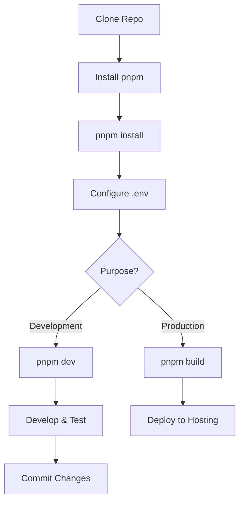

# 📚 Documentation Index

> Tổng hợp tất cả tài liệu của Base.vn Candidate Explorer

## 🚀 Getting Started

### Cho người mới bắt đầu

1. **[QUICKSTART.md](./QUICKSTART.md)** ⭐
   - Hướng dẫn nhanh 5 phút
   - Cài đặt & chạy ngay
   - Troubleshooting cơ bản

2. **[README.md](./README.md)**
   - Tổng quan dự án
   - Features & highlights
   - Quick start guide
   - API endpoints
   - Performance metrics

### Cho developers

3. **[README_PROJECT.md](./README_PROJECT.md)** 📖
   - Kiến trúc hệ thống chi tiết
   - Technology stack
   - Development workflow
   - Production deployment
   - Docker & CI/CD
   - Security considerations

4. **[HUONG_DAN_CHAY_VUE_PNPM.md](./HUONG_DAN_CHAY_VUE_PNPM.md)**
   - Hướng dẫn pnpm chi tiết
   - Cài đặt trên Windows/macOS/Linux
   - Scripts & commands
   - Troubleshooting đầy đủ
   - pnpm workspace (advanced)

## 📦 Component Documentation

### Frontend

5. **[web_vue/README.md](./web_vue/README.md)**
   - Vue 3 + Vite setup
   - Responsive features
   - Cross-platform testing
   - Build & deploy
   - Performance tips

### Backend

6. **[node_backend/README.md](./node_backend/README.md)**
   - Express server structure
   - API endpoints detail
   - Environment configuration
   - Error handling
   - Security notes

### Legacy (Optional)

7. **[streamlit_app/README.md](./streamlit_app/README.md)**
   - Python/Streamlit alternative
   - FastAPI proxy
   - Environment setup

## 📝 Additional Resources

8. **[CHANGELOG.md](./CHANGELOG.md)**
   - Version history
   - Breaking changes
   - Upgrade guides
   - Roadmap

9. **[LICENSE](./LICENSE)**
   - MIT License
   - Usage terms

10. **[HUONG_DAN_CHAY_VUE.md](./HUONG_DAN_CHAY_VUE.md)** (Legacy)
    - Original npm-based guide
    - Kept for reference

## 🎯 Use Cases

### "Tôi muốn chạy app ngay"

→ Đọc [QUICKSTART.md](./QUICKSTART.md)

### "Tôi muốn hiểu cách app hoạt động"

→ Đọc [README_PROJECT.md](./README_PROJECT.md)

### "Tôi muốn deploy lên production"

→ Đọc [README_PROJECT.md](./README_PROJECT.md) → Section "Production Build & Deploy"

### "Tôi gặp lỗi khi cài đặt/chạy"

→ Đọc [HUONG_DAN_CHAY_VUE_PNPM.md](./HUONG_DAN_CHAY_VUE_PNPM.md) → Section "Troubleshooting"

### "Tôi muốn customize frontend"

→ Đọc [web_vue/README.md](./web_vue/README.md)

### "Tôi muốn thêm API endpoint mới"

→ Đọc [node_backend/README.md](./node_backend/README.md)

### "Tôi muốn chạy trên mobile"

→ Đọc [README.md](./README.md) → Section "Cross-platform Support"

## 🔧 Development Workflow

## 📊 Documentation Stats

| File | Lines | Purpose |
|------|-------|---------|
| README.md | ~300 | Main entry point |
| README_PROJECT.md | ~650 | Full documentation |
| QUICKSTART.md | ~150 | Quick guide |
| HUONG_DAN_CHAY_VUE_PNPM.md | ~250 | pnpm guide |
| CHANGELOG.md | ~200 | Version history |
| web_vue/README.md | ~100 | Frontend docs |
| node_backend/README.md | ~150 | Backend docs |

## 🎓 Learning Path

### Beginner Level

1. Read QUICKSTART.md
2. Run the application
3. Explore the UI
4. Try basic features

### Intermediate Level

1. Read README_PROJECT.md
2. Understand architecture
3. Modify frontend styles
4. Add simple features

### Advanced Level

1. Study backend API implementation
2. Add new endpoints
3. Implement testing
4. Setup CI/CD
5. Deploy to production

## 🤝 Contributing

Want to contribute? Start here:

1. Read [README_PROJECT.md](./README_PROJECT.md) → "Contributing" section
2. Check [CHANGELOG.md](./CHANGELOG.md) → "Roadmap"
3. Fork & create feature branch
4. Follow code style (ESLint + Prettier)
5. Submit Pull Request

## 💡 Tips

### For Readers

- 📱 All docs are mobile-friendly
- 🔍 Use Ctrl+F to search within docs
- 📌 Bookmark frequently used sections
- 💬 Report unclear docs via GitHub Issues

### For Writers

- Use Markdown best practices
- Include code examples
- Add troubleshooting sections
- Keep docs up-to-date with code
- Test all commands before documenting

## 🔗 External Resources

- [Vue.js Guide](https://vuejs.org/guide/)
- [Vite Documentation](https://vitejs.dev/)
- [pnpm Documentation](https://pnpm.io/)
- [Express.js Guide](https://expressjs.com/en/guide/)
- [Base.vn API](https://hiring.base.vn/api-docs)

## 📞 Support

- 📧 GitHub Issues: [Create Issue](https://github.com/HoangThinh2024/WebAPI_App/issues)
- 💬 Discussions: [GitHub Discussions](https://github.com/HoangThinh2024/WebAPI_App/discussions)
- 📖 Wiki: [Project Wiki](https://github.com/HoangThinh2024/WebAPI_App/wiki)

---

**Last Updated:** October 2025  
**Maintained By:** HoangThinh2024  
**License:** MIT
